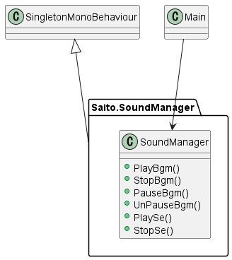

# soundmanager-unity
Unityのサウンドを統合管理するためのサウンドマネージャーです。ご自由にお使いください。
A sound manager for integrated management of Unity sounds. Feel free to use it.  

・シーン上のどこでも音を操作したかったので作成しました   
・ Resourcesでサウンドを設定するのではなく、インスペクタで登録する方式にしました(試行錯誤しやすいため)  
・派生すればオプション画面で、音量をスライダーやトグルで調整する際にも使用できると思います  
・ラベルでclipの判別をしていますが、使用したい音が多い場合はstring[]で判別すると楽になると思います
  ```
  public SeSoundData[] sedatas;
  
  void Awake()
  {
  foreach(SeSoundData s sedatas){
  s.audioSource.clip = s.clip;
  s.audioSource.volume = s.volume;
    }
  }
  
  public void PlaySe(string name){
  Sound s = sedatas.Find(s, s => s.name == name);
        
    if (s == null)
    {
      print("Sound" + name + "was not found");
      return;
    } 
   s.audioSource.PlayOneShot(s.clip);
  }
  ```

## それぞれのクラス説明

### Main インスタンスから音を再生する
・このクラスでSoundManagerのメソッドを呼び出しています。

### SingletonMonoBehaviour SoundManagerをシングルトンにする
・シングルトンでシーンをまたいでも使用可能に（dontdestroyonload単体でオブジェクトを管理するのが難しいため)  
・Monobehaviourを継承したクラスでのみ使用可能  
・一応複数個インスタンスが生成された場合に応じた処理を追加しました

### SoundManager 音のなら仕方などを統合的に管理
・Awake()なので注意が必要です・・  
・PlayBgm()でBgmの再生が行われます  
・StopBgm()でBgmの再生を止めます  
・PauseBgm()でBgmの再生が一時停止されます  
・UnPauseBgm()でBgmが一時停止された場所から再生されます  
・PlaySe()でSeの再生が行われます  
・StopSe()でSeの再生を止めます  

# 使用させていただいたサウンド
https://soundeffect-lab.info/sound/button/  
https://www.youtube.com/watch?v=PVmVlHz0QSk  
